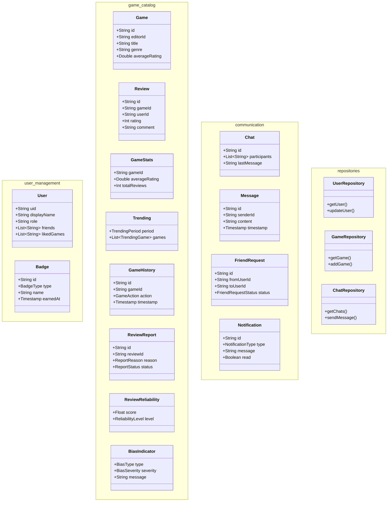

```mermaid
classDiagram
    namespace user_management {
        class User {
            +String uid
            +String displayName
            +String role
            +List~String~ friends
            +List~String~ likedGames
        }
        class Badge {
            +String id
            +BadgeType type
            +String name
            +Timestamp earnedAt
        }
    }

    namespace game_catalog {
        class Game {
            +String id
            +String editorId
            +String title
            +String genre
            +Double averageRating
        }
        class Review {
            +String id
            +String gameId
            +String userId
            +Int rating
            +String comment
        }
        class GameStats {
            +String gameId
            +Double averageRating
            +Int totalReviews
        }
        class Trending {
            +TrendingPeriod period
            +List~TrendingGame~ games
        }
        class GameHistory {
            +String id
            +String gameId
            +GameAction action
            +Timestamp timestamp
        }
        class ReviewReport {
            +String id
            +String reviewId
            +ReportReason reason
            +ReportStatus status
        }
        class ReviewReliability {
            +Float score
            +ReliabilityLevel level
        }
        class BiasIndicator {
            +BiasType type
            +BiasSeverity severity
            +String message
        }
    }

    namespace communication {
        class Chat {
            +String id
            +List~String~ participants
            +String lastMessage
        }
        class Message {
            +String id
            +String senderId
            +String content
            +Timestamp timestamp
        }
        class FriendRequest {
            +String id
            +String fromUserId
            +String toUserId
            +FriendRequestStatus status
        }
        class Notification {
            +String id
            +NotificationType type
            +String message
            +Boolean read
        }
    }

    namespace repositories {
        class UserRepository {
            +getUser()
            +updateUser()
        }
        class GameRepository {
            +getGame()
            +addGame()
        }
        class ChatRepository {
            +getChats()
            +sendMessage()
        }
    }
```
