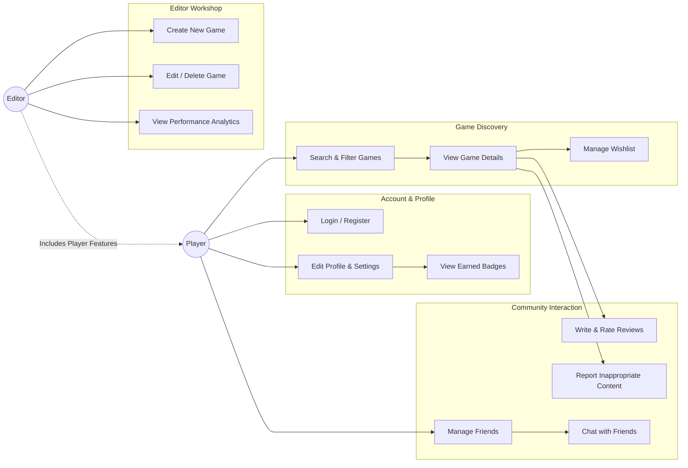

```mermaid
graph LR
    %% Actors
    Player((Player))
    Editor((Editor))

    %% Functional Areas
    subgraph "Account & Profile"
        Auth[Login / Register]
        Profile[Edit Profile & Settings]
        Badges[View Earned Badges]
    end

    subgraph "Game Discovery"
        Search[Search & Filter Games]
        Details[View Game Details]
        Wishlist[Manage Wishlist]
    end

    subgraph "Community Interaction"
        Review[Write & Rate Reviews]
        Report[Report Inappropriate Content]
        Friends[Manage Friends]
        Chat[Chat with Friends]
    end

    subgraph "Editor Workshop"
        Create[Create New Game]
        Update[Edit / Delete Game]
        Metrics[View Performance Analytics]
    end

    %% Player Capabilities
    Player --> Auth
    Player --> Profile
    Player --> Search
    Player --> Friends

    %% Connections between features
    Profile --> Badges
    Search --> Details
    Details --> Wishlist
    Details --> Review
    Details --> Report
    Friends --> Chat

    %% Editor Capabilities
    Editor --> Create
    Editor --> Update
    Editor --> Metrics
    
    %% Editor 'Is A' Player relationship
    Editor -. Includes Player Features .-> Player
```
